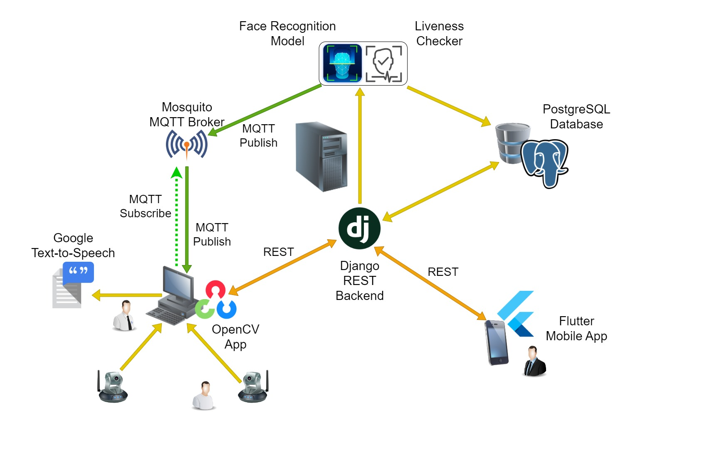

<h1 align="center">⚡Automated Attendance System⚡</h1>

<h2 align="center">🏢System Architecture🛠️</h2>




# Developer Guide

* First, clone the repository. 
    
    ```
    git clone https://github.com/SharadaShehan/Automated_Attendance_System.git
    ```
* Python version 3.10.9 is recommended.
* Run Backend and Cam Stream App in a virtual environment.
* PyCharm IDE is recommended for initializing project.

#### Requirements

* Following applications must be installed and running on your local machine, before starting project.

    ```
    PostgreSQL database server
    Mosquitto MQTT Broker
    ```

## Backend

1) Navigate to the backend repository.

    ```
    cd Automated_Attendance_System/backend
    ```

2) Then run following commands to create and activate a python environment.

    ```
    py -m venv venv
    ```
    ```
    venv\Scripts\Activate
    ```

    If your Python virtual environment works fine, then in the command line should be something similar to this.
    
    ```
    (venv) C:\...\Automated_Attendance_System\backend>
    ```

3) Now, in order to install the required python libraries, open backend project in PyCharm IDE.
Configure IDE to use python interpreter which is in the created virtual environment.
Then, open `requirements.txt` file in IDE and IDE will recommend to install libraries listed in file. Allow it to install them. IDE may fail to install `dlib` and `face_recognition` libraries.

4) Run below commands to install `dlib` and `face_recognition` libraries.

    ```
    pip install "ROOT_PATH/Automated_Attendance_System/backend/dlib-19.22.99-cp310-cp310-win_amd64.whl"
    ```
    ```
    pip install face_recognition
    ```
    Replace `ROOT_PATH` text with actual path of parent directory of Automated_Attendance_System folder.

5) Create `.env` file in `/backend/backend/` location with following variables in it.

    ```
    DEBUG=1
    SECRET_KEY=your_secret_key
    DJANGO_ALLOWED_HOSTS=localhost 127.0.0.1 [::1]
    SQL_ENGINE=django.db.backends.postgresql
    SQL_DATABASE=database_name
    SQL_USER=database_user
    SQL_PASSWORD=database_password
    SQL_HOST=localhost
    SQL_PORT=5432
    MQTT_BROKER=localhost
    MQTT_PORT=1883
    MQTT_TOPIC=attendance
    MIN_MINUTES_THRESHOLD=10
    ```
    Replace `SQL_DATABASE`, `SQL_USER`, `SQL_PASSWORD`, `SQL_PORT` environment variables values with relevant credentials for your local PostgreSQL database and `MQTT_BROKER`, `MQTT_PORT`, `MQTT_TOPIC` environment variables values with relevant credentials for your local mosquitto broker.
    `MIN_MINUTES_THRESHOLD` is the minimum duration between two detections from same user to consider second detection as an attendance.

6) In command line, move to location `Automated_Attendance_System/backend/` and Apply Model migrations to PostgreSQL database using following commands.

    ```
    python manage.py makemigrations
    ```
    ```
    python manage.py migrate
    ```

7) Run this command to run the Local Server.

    ```
    python manage.py runserver
    ```

Important : Following steps must be taken, only when developing frontend application. As data defined in scripts, do not contain sensitive user encodings, this sample database will not support cam stream app.

8) Now you can populate your local database with set of data defined in scripts, by making an API call to below endpoint.

    ```
    http://127.0.0.1:8000/scripts/init
    ```

9) Then, If you want to reset your database with data defined in scripts, run below commands and then make an API call to above API.

    ```
    python manage.py migrate database zero
    ```
    ```
    python manage.py migrate
    ```

## Cam Stream App

* Run Application in a virtual environment.

1) Navigate to the cam app repository.

    ```
    cd Automated_Attendance_System/cam_app
    ```

2) Then run following commands to create and activate a python environment.

    ```
    py -m venv venv
    ```
    ```
    venv\Scripts\Activate
    ```

    If your Python virtual environment works fine, then in the command line should be something similar to this.
    
    ```
    (venv) C:\...\Automated_Attendance_System\backend>
    ```

3) Now, in order to install the required python libraries run this command.

    ```
    pip install -r requirements.txt
    ```

4) Create `.env` file in `/cam_app/` home directory with following variables in it.

    ```
    FRAME_WIDTH=200
    FRAME_HEIGHT=150
    BACKEND_BASE_URL=http://127.0.0.1:8000/middleware
    MQTT_BROKER_URL=localhost
    MQTT_BROKER_PORT=1883
    MQTT_TOPIC=attendance
    ```
    Replace `MQTT_BROKER_URL`, `MQTT_BROKER_PORT`, `MQTT_TOPIC` environment variables values with relevant credentials for your mosquitto broker.
    `FRAME_WIDTH`, `FRAME_HEIGHT` environment variables define the size of frames you are expecting to send to backend for processing.
    
5) In home directory, Run following command to start the Cam Stream App.
    
    ```
    python main.py
    ```

## Frontend

<p align="center" style="color:yellow;font-size:18px;">
< --   Open for Contributions   -- >
</p>
