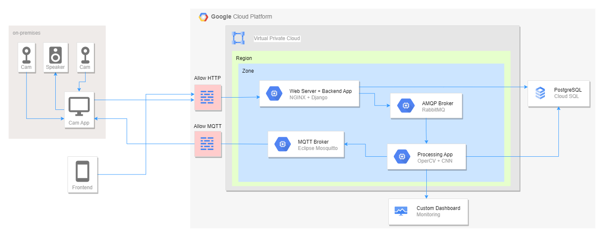
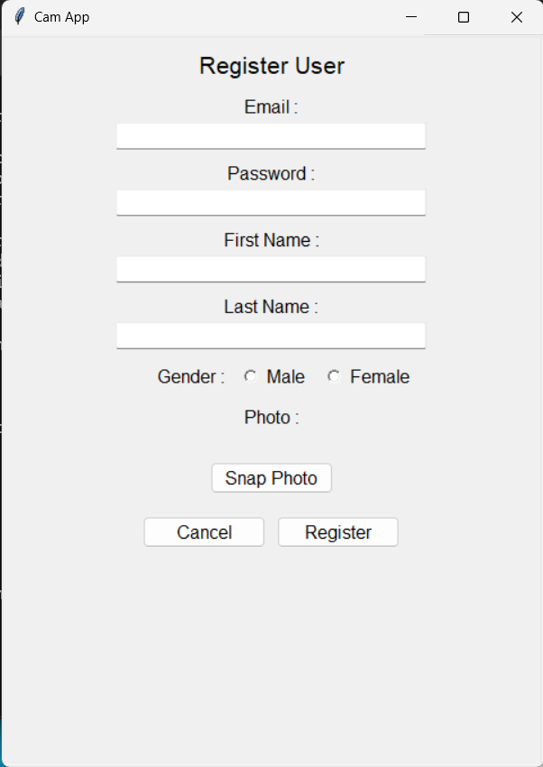
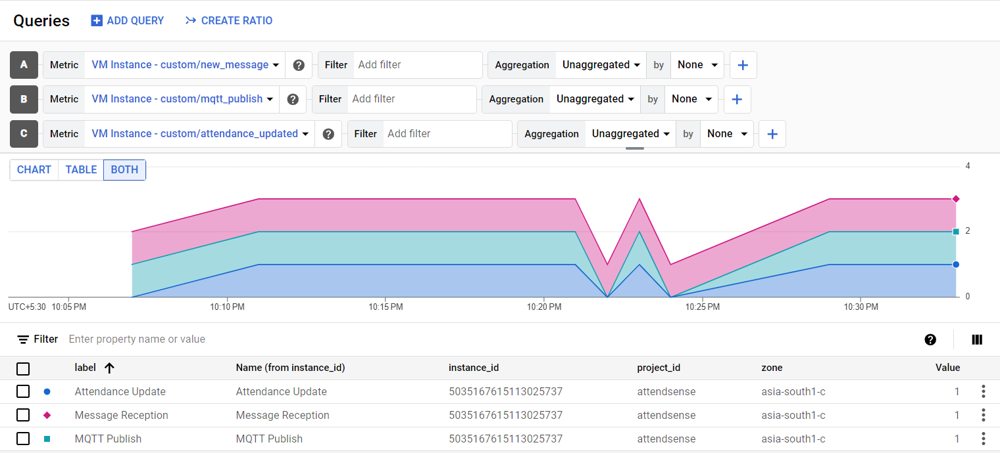
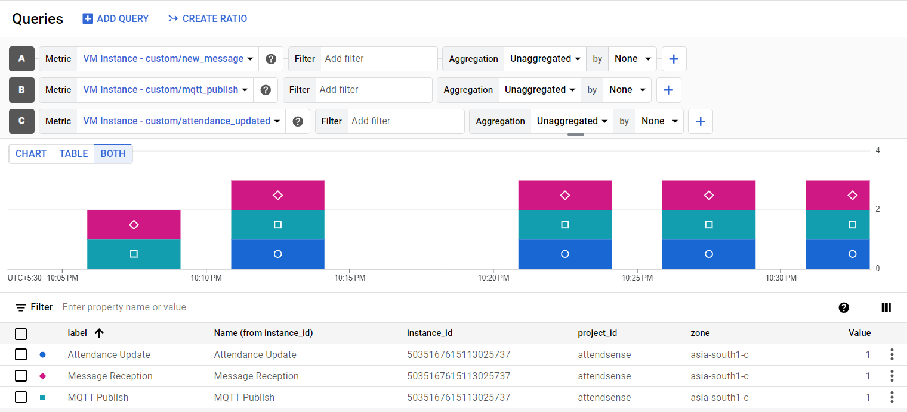
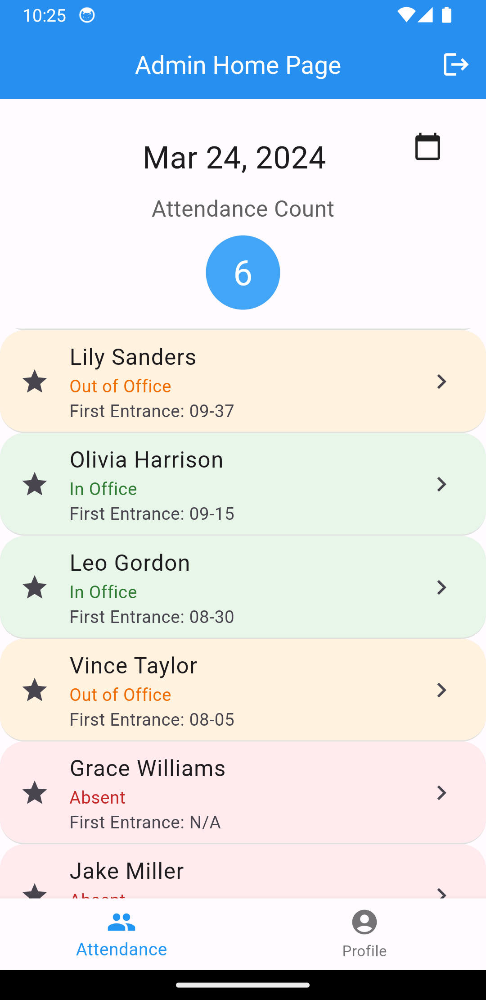
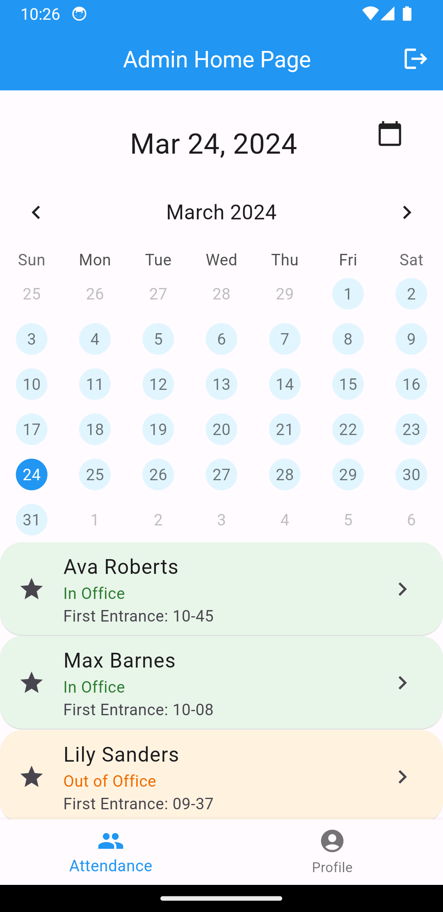
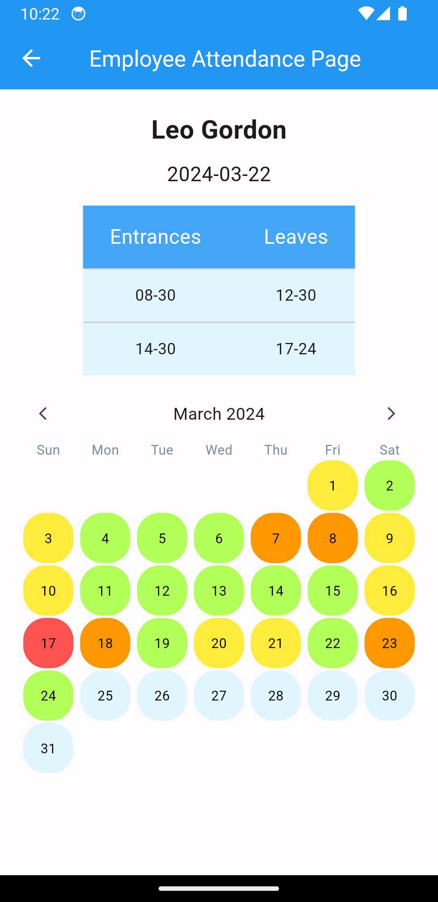

<h1 align="center">⚡Automated Attendance System⚡</h1>

<h2 align="center">🏢System Architecture🛠️</h2>

## Cam Stream Application

  
   
  

## Backend

The Django Rest Framework is used for developing the backend infrastructure of the application. This backend application is tasked with managing incoming requests from both the frontend and the camera stream application. Its functionalities encompass the registration of company and employees, as well as the facilitation of attendance updates through processing requests received from the camera stream application.

Token-based authentication mechanisms are employed to verify the legitimacy of requests arriving from both the frontend and camera stream application. Once authenticated, images associated with these requests are sent into a queue within the Advanced Message Queuing Protocol (AMQP) broker for subsequent processing.

NGINX is used as a reverse proxy server to efficiently route HTTP traffic to the Django server.

## Processing Application

A Face Recognition model operates within a processing application, consuming messages from an AMQP broker and analyzing the images contained within. Its primary function is to identify employees' faces by generating encodings for each input image and comparing them against registered user encodings. This comparison process identifies the best matching user and verifies the accuracy of the match. Additionally, a Convolutional Neural Network (CNN) pretrained for spoof detection is employed to ensure the input image is not a spoof.

Following the identification process, the model determines whether the user's attendance needs updating by referencing the user's latest attendance records, thus preventing immediate detections from being marked as multiple attendance instances. Upon updating the database, the model publishes a message to an MQTT broker for real-time communication with the Camera Stream Application.

Furthermore, the application is integrated with Google Cloud Monitoring to monitor its performance. Custom metric values are regularly pushed to the Google Cloud Monitoring Dashboard, providing real-time insights into the application's operation and efficiency.

## Frontend

The Flutter Application offers intuitive interfaces for both employees and administrators. Employees can securely log in to access their attendance records, allowing them to review their historical attendance data.

Administrators, on the other hand, are empowered with comprehensive insights into attendance management. They can effortlessly monitor the attendance of individual employees, discerning their current attendance status—whether they are present, absent, or even physically in the office. Additionally, administrators have access to a summarized overview of all attendance records for each date, facilitating efficient management and oversight of attendance data.

  
   
  

